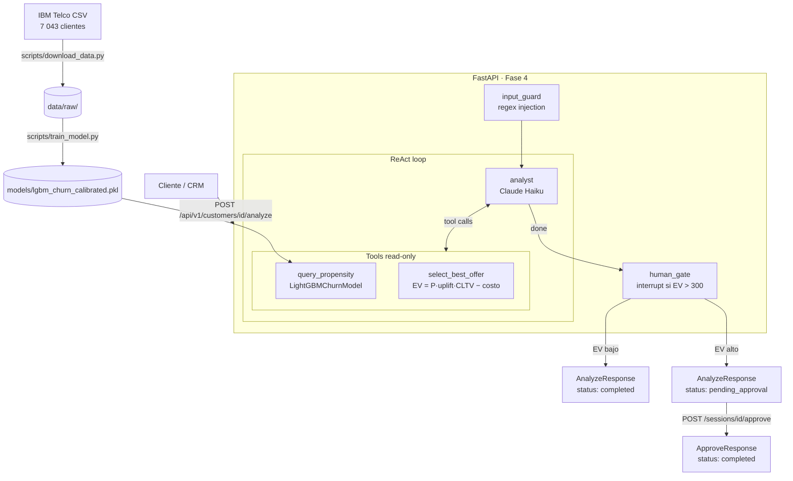

# Churn Retention Agent

> Agente de retención anti-churn con **human-in-the-loop**: un modelo de
> propensión calibrado alimenta a un agente LLM que razona sobre el cliente,
> calcula el valor económico esperado de la mejor oferta y redacta la
> recomendación, dejando la ejecución final bajo una **compuerta humana**.

No es "otro modelo de churn" ni un chatbot. Es un sistema agéntico con cuatro
capas: ML clásico (propensión calibrada + drivers SHAP), economía de ofertas
(EV = P·CLTV − costo), capa agéntica (LangGraph ReAct con HITL) y API REST
para integraciones externas.

## Demo en vivo

> **[▶ Abrir demo en Hugging Face Spaces](https://huggingface.co/spaces/victorlr94/churn-retention-agent)**
> _(disponible tras el deploy; sin API key, sin coste)_

O localmente:

```bash
git clone https://github.com/victorlr94/churn-retention-agent
cd churn-retention-agent
uv sync --extra demo        # instala Streamlit (y el resto del entorno)
uv run streamlit run app.py # abre http://localhost:8501
```

El modo demo usa un **LLM determinista** (sin ANTHROPIC\_API\_KEY) y datos de
muestra commiteados — propensión, EV y compuerta HITL son **reales**.

## Problema que resuelve

Las telcos pierden ingresos por churn. El error común es predecir el churn y
disparar descuentos a ciegas. Aquí el sistema **prioriza por valor económico
esperado** y deja que un humano apruebe la acción en clientes de alto valor,
alineado con la exigencia de supervisión humana en decisiones de alto impacto.

## Arquitectura



## Stack tecnológico

| Capa | Herramienta | Rol |
|------|-------------|-----|
| Entorno | **uv** | Gestión de deps y lockfile reproducible |
| Calidad | **Ruff + mypy strict + pre-commit** | Formato, lint, tipos, hooks |
| Seguridad | **gitleaks + guards** | Escaneo de secretos + prompt injection |
| Datos | **pandera** | Validación de esquema + guardia de leakage |
| Modelo | **LightGBM + IsotonicRegression + SHAP** | Propensión calibrada + drivers explicables |
| Economía | Custom (`economics/ev.py`) | EV = P·uplift·CLTV − costo; catálogo LIGHT/STANDARD/PREMIUM |
| Agente | **LangGraph + Claude Haiku** | ReAct loop con `interrupt()` HITL nativo |
| API | **FastAPI + uvicorn** | REST con Swagger auto-generado; HITL en dos pasos |
| CI | **GitHub Actions** | Lint + tipos + tests en cada PR |

## Instalación

Requisitos: [uv](https://docs.astral.sh/uv/) instalado (instala Python solo).

```bash
git clone https://github.com/victorlr94/churn-retention-agent
cd churn-retention-agent
uv sync --frozen          # entorno idéntico al lock; Python 3.12 automático
uv run pytest             # 98 tests, sin necesitar el CSV real
```

## Ejecución

### 1. Datos

```bash
# Lee las instrucciones del script (descarga manual desde Kaggle requerida)
uv run python scripts/download_data.py
```

Coloca `telco_customer_churn.csv` en `data/raw/` y ejecuta el script para
verificar el checksum SHA-256.

### 2. Entrenamiento del modelo

```bash
uv run python scripts/train_model.py
```

Salida esperada:

```
[1/5] Cargando datos...
      7043 clientes · 24 features · churn rate: 26.5%
      train=4225 · val=1409 · test=1409
[2/5] Entrenando baselines...
[3/5] Entrenando LightGBM...
[4/5] Calibrando...
[5/5] Evaluando en test set...
      Modelo: AUC-ROC=0.848  AUC-PR=0.649  Brier=0.135  lift@decil1=2.8x
```

### 3. Demo interactiva (sin API key)

```bash
uv sync --extra demo
uv run streamlit run app.py    # abre http://localhost:8501
```

La demo usa datos de muestra commiteados y un LLM falso determinista.
Prueba un cliente normal, uno de alto valor (activa HITL) y un ID con
`ignore` para ver el input guard en acción.

### 4. CLI del agente

```bash
# Requiere ANTHROPIC_API_KEY en .env
uv run python scripts/run_agent.py --customer-id 3668-QPYBK --no-hitl
```

### 5. API REST

```bash
# Copia .env.example a .env y añade ANTHROPIC_API_KEY
cp .env.example .env

uv run uvicorn churn_agent.api.app:app --reload --host 0.0.0.0 --port 8000
```

Swagger UI en: `http://localhost:8000/docs`

**Flujo HITL via API:**

```bash
# Paso 1: analizar cliente
curl -X POST http://localhost:8000/api/v1/customers/3668-QPYBK/analyze

# Si la respuesta es status: "pending_approval", aprobar con el session_id devuelto:
curl -X POST http://localhost:8000/api/v1/sessions/<session_id>/approve \
     -H "Content-Type: application/json" \
     -d '{"approved": true}'
```

## Evaluación del modelo

Métricas en test set (1 409 clientes, churn rate 26.5%):

| Modelo | AUC-ROC | AUC-PR | Brier | lift@decil1 |
|--------|---------|--------|-------|-------------|
| Mayoría (baseline) | 0.500 | 0.265 | 0.195 | 1.0× |
| Logística (baseline) | ~0.810 | ~0.580 | ~0.155 | ~2.2× |
| **LightGBM calibrado** | **~0.848** | **~0.649** | **~0.135** | **~2.8×** |

El LightGBM obtiene ~2.8× lift en el decil de mayor riesgo — el 10% de clientes
que el modelo señala como más propensos a churn contiene ~2.8× más churners reales
que el promedio. La calibración (isotónica) garantiza que la probabilidad devuelta
sea real y pueda usarse en la fórmula de EV sin escalar.

**No se reporta accuracy**: el churn está desbalanceado (26.5% positivo);
accuracy es engañosa en este contexto.

## Guardrails y seguridad

| Capa | Mitigación |
|------|-----------|
| Secrets | `.gitignore` de `.env*`, gitleaks en pre-commit |
| Leakage | `LeakageError` si `Churn Score / Reason / Category` entran a X |
| Prompt injection | Regex en `input_guard` (11 patrones, case-insensitive) antes del LLM |
| Output | `check_output_offer` verifica que el tier pertenezca al catálogo |
| HITL | `interrupt()` de LangGraph cuando EV > `CHURN_HITL_EV_THRESHOLD` (default 300 MXN) |
| Irreversibilidad | Las tools son read-only; el agente nunca ejecuta acciones externas |

Threat model completo en [docs/SECURITY.md](docs/SECURITY.md).

## Datos

IBM Telco Customer Churn — sintético, 7 043 clientes, 33 columnas. Leakage
conocido (`Churn Score / Reason / Category`) excluido con guardia explícita.
Detalle en [docs/DATA_CARD.md](docs/DATA_CARD.md).

## Limitaciones (honestidad técnica)

- **Snapshot point-in-time**: sin dimensión temporal → propensión en un momento,
  no probabilidad de churn en N días.
- **Datos sintéticos**: el modelo rinde mejor de lo esperado en producción.
- **MemorySaver en memoria**: el estado HITL se pierde si el servidor reinicia;
  para producción se reemplazaría por `SqliteSaver` o `PostgresSaver`.
- **Sin uplift model**: los `retention_uplift` del catálogo son supuestos; en
  producción se calibrarían con un experimento A/B.
- **Acción mock**: el agente no envía mensajes reales; la decisión se registra.

## Roadmap

| Fase | Entregable | Estado |
|------|-----------|--------|
| 0. Setup | Repo, entorno uv, CI, docs base | ✅ |
| 1. Datos | Descarga, validación, split sin leakage | ✅ |
| 2. Modelo | Propensión calibrada + SHAP + baselines | ✅ |
| 3. Agente | LangGraph ReAct + guardrails + HITL | ✅ |
| 4. API | FastAPI REST + Swagger + tests | ✅ |
| 5. Evaluación agente | Eval set + gate en CI | ✅ |
| 6. Observabilidad | Tracing costo/latencia por sesión | ✅ |
| 7. Demo interactiva | App Streamlit + modo offline + deploy HF Spaces | ✅ |

## Aprendizajes

**El leakage es el descalificador silencioso.** `Churn Score` y `Churn Reason`
están derivados del propio churn; usarlos como features arruina la credibilidad
del sistema aunque las métricas se vean perfectas. La guardia explícita
(`LeakageError`) asegura que el error sea ruidoso e inmediato.

**Calibración antes que accuracy.** El EV de la oferta exige una probabilidad
real en [0,1], no un score sin calibrar. Sin calibración isotónica, el modelo
sobreestima la propensión en clientes de alto riesgo y el EV calculado es
incorrecto → el negocio tomaría decisiones con datos falsos.

**`CalibratedClassifierCV(cv="prefit")` desapareció en sklearn ≥1.6.** La
documentación de sklearn decía "deprecated" pero lo eliminaron silenciosamente.
Diseñamos `_CalibratedModel` como wrapper explícito sobre `IsotonicRegression`,
lo que resultó ser más claro y testeable que el comportamiento original.

**LangGraph: el `interrupt()` nativo justifica la dependencia.** HITL en un
grafo cíclico implementado a mano requiere checkpointing, serialización de estado
y manejo de callbacks asincrónicos. LangGraph lo da en tres líneas. El trade-off
(~20 dependencias transitivas) vale para este patrón de uso.

**FastAPI DI desacopla el grafo de los tests.** Con `app.dependency_overrides`,
los tests de la API inyectan un grafo mockeado sin levantar un servidor real.
Los tests corren en milisegundos y son completamente deterministas.

## ADRs

| ADR | Decisión |
|-----|---------|
| [ADR-0001](docs/architecture/adr/ADR-0001.md) | Estructura del proyecto y separación núcleo/dominio |
| [ADR-0002](docs/architecture/adr/ADR-0002.md) | Guardia de leakage y exclusión de columnas |
| [ADR-0003](docs/architecture/adr/ADR-0003.md) | LightGBM sobre XGBoost/RF/CatBoost |
| [ADR-0004](docs/architecture/adr/ADR-0004.md) | LangGraph sobre LCEL/CrewAI |
| [ADR-0005](docs/architecture/adr/ADR-0005.md) | FastAPI sobre Flask/DRF |
| [ADR-0006](docs/architecture/adr/ADR-0006.md) | Evaluación determinista del agente sin API key |
| [ADR-0007](docs/architecture/adr/ADR-0007.md) | Observabilidad: log JSONL de sesiones |
| [ADR-0008](docs/architecture/adr/ADR-0008.md) | Demo offline con StatefulFakeLLM y fixtures commiteadas |

## Licencia

MIT. Los datos tienen su propia licencia: ver [docs/DATA_CARD.md](docs/DATA_CARD.md).
