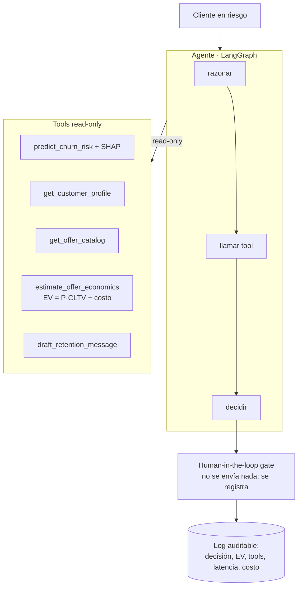

# Churn Retention Agent

> Agente de retención anti-churn con **human-in-the-loop**: un modelo de
> propensión calibrado alimenta a un agente LLM que razona sobre el cliente,
> decide la mejor acción de retención, calcula su valor económico esperado y
> redacta el mensaje, dejando la ejecución final tras una **compuerta humana**.

No es "otro modelo de churn" ni un chatbot. Es un sistema agéntico con cuatro
capas: ML clásico (propensión calibrada + drivers explicables), capa agéntica
(tool-calling y economía de ofertas), evaluación en dos niveles (modelo y
agente) y gobernanza/seguridad (trazabilidad, guardrails, human-in-the-loop).

## Problema que resuelve

Las telcos pierden ingresos por churn. El error común es predecir el churn y
"disparar" descuentos a ciegas. Aquí el sistema **prioriza por valor económico
esperado** —`EV = P(retener)·CLTV − costo`— y deja que un humano apruebe la
acción, alineado con la exigencia de supervisión humana en decisiones de alto
impacto.

## Arquitectura



Las tools son **read-only** y la acción es **mock + gateada**: el agente nunca
ejecuta nada irreversible. Es a la vez una decisión de seguridad y de honestidad.

Detalle completo en [docs/ARCHITECTURE.md](docs/ARCHITECTURE.md).

## Stack tecnológico

| Capa | Herramienta | Rol |
|------|-------------|-----|
| Entorno | **uv** | Gestión de deps y lockfile reproducible |
| Calidad | **Ruff + mypy + pre-commit** | Formato, lint, tipos, hooks |
| Seguridad | **gitleaks** | Escaneo de secretos en cada commit |
| Modelo | LightGBM/XGBoost + calibración + SHAP | Propensión + drivers *(Fase 2)* |
| Agente | LangGraph | Orquestación razonar→tool→decidir→gate *(Fase 4)* |
| API/Demo | FastAPI + Streamlit | Servicio y demo *(Fase 6)* |
| CI | GitHub Actions | Lint + tipos + tests + evals con gate |

## Instalación

Requisitos: [uv](https://docs.astral.sh/uv/) (instala Python solo).

```bash
git clone <repo> && cd churn-retention-agent
uv sync --frozen     # entorno idéntico al lock
uv run pytest        # smoke test
```

## Ejecución

> En construcción. La descarga de datos, el entrenamiento del modelo, el agente
> y la demo se añaden en las fases siguientes (ver Roadmap).

## Evaluación

Dos niveles (ver [docs/ARCHITECTURE.md](docs/ARCHITECTURE.md)):

- **Modelo**: AUC-PR, recall@decil, lift, calibración (reliability + Brier),
  contra baseline (clase mayoritaria + regresión logística). Nunca *accuracy* a
  secas: el churn está desbalanceado.
- **Agente**: éxito de tarea, latencia y costo por tarea, trajectory eval
  (¿tools correctas, mayor EV?), LLM-as-judge y tests de guardrails
  adversariales. Corre en CI con umbral (*ship gate*).

## Seguridad

Threat model y mitigaciones en [docs/SECURITY.md](docs/SECURITY.md). Resumen:
secretos fuera del repo (gitleaks), tratamiento de notas del cliente como input
no confiable (prompt injection), guardrail de ofertas (solo catálogo), tools
read-only, y trazabilidad de cada decisión.

## Datos

IBM Telco Customer Churn (sintético, 7.043 clientes). Origen, licencia y, sobre
todo, **leakage conocido** (Churn Score/Reason/Category se excluyen del
entrenamiento) en [docs/DATA_CARD.md](docs/DATA_CARD.md).

## Limitaciones (honestidad técnica)

- **Snapshot point-in-time**: sin dimensión temporal → es scoring de propensión,
  no un modelo time-to-event.
- **Datos sintéticos y muy limpios**: el modelo se ve mejor de lo que se vería en
  producción. Se declara como limitación conocida.
- **Acción mock**: no se envían mensajes reales; el human-in-the-loop registra la
  decisión.

## Roadmap

| Fase | Entregable | Estado |
|------|-----------|--------|
| 0. Setup | Repo, entorno uv, CI, docs base | ✅ |
| 1. Datos | Descarga, validación, split sin leakage | ⬜ |
| 2. Modelo | Propensión calibrada + baseline + SHAP | ⬜ |
| 3. Tools | 5 tools + economía de ofertas | ⬜ |
| 4. Agente | Grafo LangGraph + guardrails | ⬜ |
| 5. Evaluación | Eval set + gate en CI | ⬜ |
| 6. API + demo | FastAPI + Streamlit (Docker) | ⬜ |
| 7. Observabilidad | Tracing costo/latencia | ⬜ (stretch) |

## Aprendizajes

- **El leakage es el descalificador silencioso**: Churn Score/Reason vienen
  derivados del propio churn; usarlos como features arruina la credibilidad.
- **Calibración antes que accuracy**: el EV de la oferta exige una probabilidad
  real, no un score.
- **Cuándo NO usar un agente**: un grafo simple de 5 tools basta; multi-agente
  sería sobre-ingeniería.

## Licencia

MIT (ver `LICENSE` cuando se añada). Los datos tienen su propia licencia: ver
[docs/DATA_CARD.md](docs/DATA_CARD.md).
