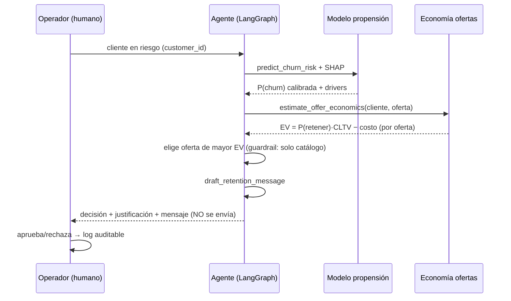

# Arquitectura

## Visión general

Sistema agéntico de retención con cuatro capas:

1. **ML clásico** — modelo de propensión calibrado + drivers explicables (SHAP).
2. **Agéntica** — agente LLM con tool-calling y economía de ofertas.
3. **Evaluación** — dos niveles: modelo y agente, con gate en CI.
4. **Gobernanza/seguridad** — trazabilidad, guardrails, human-in-the-loop.

## Frontera núcleo / dominio

Siguiendo la separación reutilizable vs específico de dominio:

- **Núcleo reutilizable** (`src/churn_agent/core/`): contratos (`Protocol`),
  configuración, excepciones, infraestructura agnóstica. mypy `strict`.
- **Dominio/aplicación** (`data`, `model`, `economics`, `agent`, `api`): lógica
  específica de este caso. Depende del núcleo, nunca al revés.

Toda dependencia difícil de cambiar (LLM, modelo) vive detrás de un `Protocol`
(`src/churn_agent/core/interfaces.py`), de modo que intercambiar la
implementación o inyectar un fake en tests toque un archivo, no veinte.

## Estructura de carpetas

```text
churn-retention-agent/
├── src/churn_agent/
│   ├── config.py          # Settings (Pydantic) — fuente única de verdad
│   ├── exceptions.py      # excepciones de dominio
│   ├── core/              # NÚCLEO: interfaces (Protocols), infra agnóstica
│   ├── data/              # carga, validación de esquema, splits (Fase 1)
│   ├── model/             # entrenamiento, calibración, SHAP (Fase 2)
│   ├── economics/         # EV de ofertas (Fase 3)
│   ├── agent/             # grafo LangGraph, tools, prompts (Fase 4)
│   └── api/               # FastAPI (Fase 6)
├── eval/                  # evals de modelo y agente + datasets (Fase 5)
├── tests/                 # unit / integration / security
├── app/                   # demo Streamlit (Fase 6)
├── notebooks/             # exploración (no productivo)
├── data/{raw,processed}/  # gitignored; script de descarga
├── scripts/               # download_data, verify_repro, evaluate
└── docs/                  # README extendido, ADRs, diagramas, este archivo
```

## Flujo de decisión



## Decisiones (ADRs)

Las decisiones no obvias se documentan en `docs/architecture/adr/`:

- [ADR-0001](architecture/adr/0001-uv-como-gestor-de-entorno.md) — uv como gestor de entorno.
- [ADR-0002](architecture/adr/0002-exclusion-de-columnas-con-leakage.md) — exclusión de columnas con leakage.

## Configuración

Una sola `Settings` (Pydantic Settings) en `src/churn_agent/config.py`, cargando
`.env`. Se inyecta hacia abajo; el núcleo no lee variables globales ni números
mágicos dispersos.
